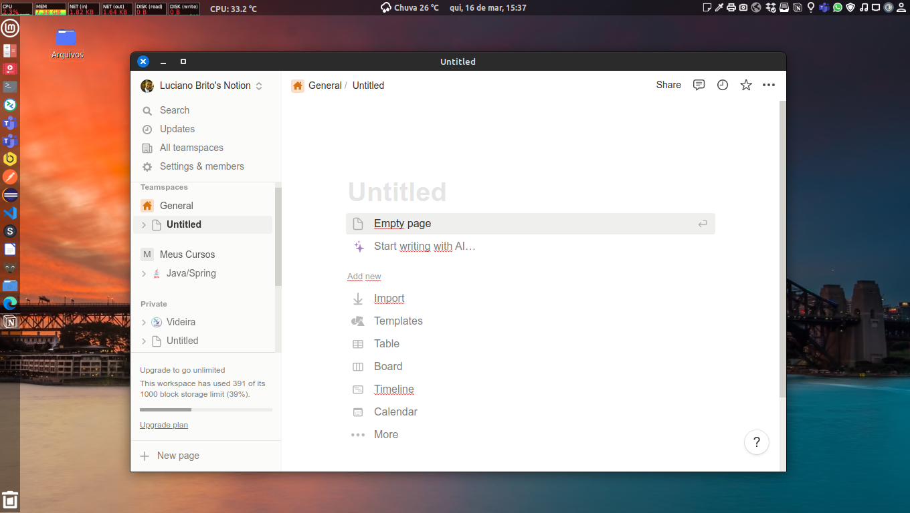
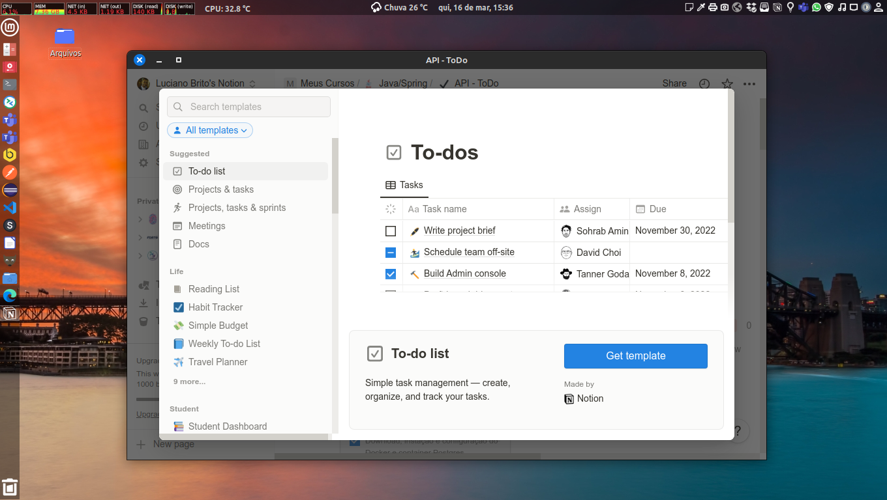

# Notion-Desktop







## Description

The Notion-Desktop is a Electron desktop client for Notion.

**Attention!**
This application was initially developed for unix like environments, if you want to run it in other environments make sure that all dependencies are satisfied.


## Installation

Open the `build/installers` folder and download and install the notion-desktop*.deb.


## Compiling the Project Locally

1. To compile the application, first of all, clone the project or download the zipped source code to your local machine.
2. Access the project folder and run the command to download the dependencies:
```
$ npm install
```
3. run the command to build the application.
```
$ npm run build
```
4. Access the `build/installers/` in project and install the generated notion-desktop*.deb package.

With that the application will be working. Now you can translate your texts locally.


## Contributors

[Luciano Brito](https://github.com/lucianobritodev)

Brazilian, married, born in 1991, passionate about technology. Graduated in Systems Analysis and Development from Paulist University (UNIP) in 2019 and Post Graduate in Software Architecture from Infnet Institute in 2023.


## Contacts

- [LinkeIn](https://www.linkedin.com/in/luciano-brito-dev)
- [Gmail](mailto:lucianobrito.dev@gmail.com)
- [Instagram](https://www.instagram.com/lucianobrito.dev)


## Donates

[](https://www.paypal.com/donate/?hosted_button_id=SX3L4N89M8ZRW)